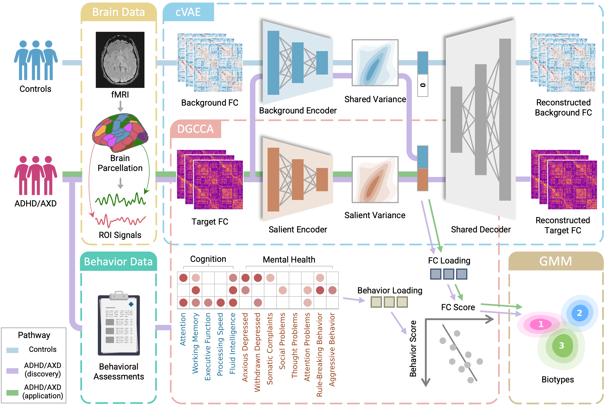

# DeCoDE

**A deep learning framework for contrastive dimensional embedding**

DeCoDE is designed to identify robust, transdiagnostic brain–behavior dimensions and neurophysiological biotypes by integrating functional connectivity with behavioral measures.

---

Yong Jiao, Xiaoyu Tong, Gregory A. Fonzo, Ian H. Gotlib, Kilian M. Pohl, Theodore D. Satterthwaite, Jing Jiang, Yu Zhang
[**Deep Learning of Brain–Behavior Dimensions Identifies Transdiagnostic Biotypes in Youth with ADHD and Anxiety Disorders**](https://www.biorxiv.org/content/10.1101/2025.10.13.682243v1.abstract)

<div align=center>

</div>

## Project Structure

```text
.
├── assets/
│   └── flowchart.png                   # Method overview figure
├── data.py                             # Shared input loading and score aggregation
├── hyperparameter_config.json          # Search spaces and training settings
├── models.py                           # cVAE and GCCA model components
├── 1_hyperparameter_search.py          # TPE and grid search
├── 2_DeCoDE_pipeline.py                # Full-data final fit and biotyping
├── 3_independent_validation.py         # Independent-cohort validation
├── requirements.txt                    # Python dependencies
└── README.md                           # This file
```

## Dataset

- [Adolescent Brain Cognitive Development (ABCD) Study](https://abcdstudy.org/)
- [Healthy Brain Network (HBN)](https://fcon_1000.projects.nitrc.org/indi/cmi_healthy_brain_network)

## Dependencies

This project is implemented in Python 3.14.2. Install dependencies via:

```bash
pip install -r requirements.txt
```

## Workflow

### Input data

The search and full-data fit use the prepared ABCD connectivity NPZ and behavior
CSV. The search space and training settings are defined in
`hyperparameter_config.json`. GCCA training and biotyping use up to 16 canonical
dimensions, capped by the available behavior and latent dimensions; model
selection and early stopping use the first three dimensions.
Within each training epoch, the target and background groups are independently
shuffled and partitioned without replacement into 10 batches. Both groups
therefore contribute the same number of optimization steps with group-specific
batch sizes, while every observation is used once per epoch.

The connectivity NPZ contains these arrays:

| Array | Shape | Contents |
| --- | --- | --- |
| `participant_ids` | `(n_target_runs,)` | Unicode/string ID for every row of `target_fc`; IDs may repeat when a participant has multiple runs. |
| `target_fc` | `(n_target_runs, n_features)` | Numeric target-group FC features. |
| `background_fc` | `(n_background_runs, n_features)` | Numeric background-group FC features with the same number and order of features as `target_fc`. |

`participant_ids` must be stored as a NumPy Unicode/string array, not an object
array. The behavior CSV must have one unique `participant_id` row per target
participant and one or more numeric measure columns. Its IDs are matched to
`participant_ids`; do not include nonnumeric metadata columns.

For example, save preprocessed matrices with:

```python
np.savez(
    "connectivity.npz",
    participant_ids=np.asarray(target_ids, dtype=str),
    target_fc=np.asarray(target_fc, dtype=np.float32),
    background_fc=np.asarray(background_fc, dtype=np.float32),
)
```

### 1. Hyperparameter search

```bash
python 1_hyperparameter_search.py tpe \
  --connectivity_file /path/to/connectivity.npz \
  --behavior_file /path/to/behavior.csv
```

```bash
python 1_hyperparameter_search.py grid \
  --connectivity_file /path/to/connectivity.npz \
  --behavior_file /path/to/behavior.csv
```

### 2. Full-data fit and biotyping

Pass the selected completed trial (typically the grid-search result) to the
final fitting command. It uses that trial's best parameters and
cross-validation-selected epoch to fit on all target and background data, then
writes `model.pt`, `scores.npz`, `biotypes.csv`, and `run_summary.json`.

```bash
python 2_DeCoDE_pipeline.py \
  --connectivity_file /path/to/connectivity.npz \
  --behavior_file /path/to/behavior.csv \
  --best_trial_file outputs/hyperparameter_optimization/decode_grid_search/best_trial.json
```

### 3. Independent validation

For HBN, use an NPZ containing `participant_ids` and `fc`; `fc` must use the
same preprocessing and feature order as the ABCD training data. The behavior
CSV must contain the same behavior columns as the ABCD input.

```bash
python 3_independent_validation.py \
  --connectivity_file data/HBN/connectivity.npz \
  --behavior_file data/HBN/behavior.csv \
  --fit_dir outputs/final_fit
```

Search, fit, and validation outputs are written to `outputs/` by default.
